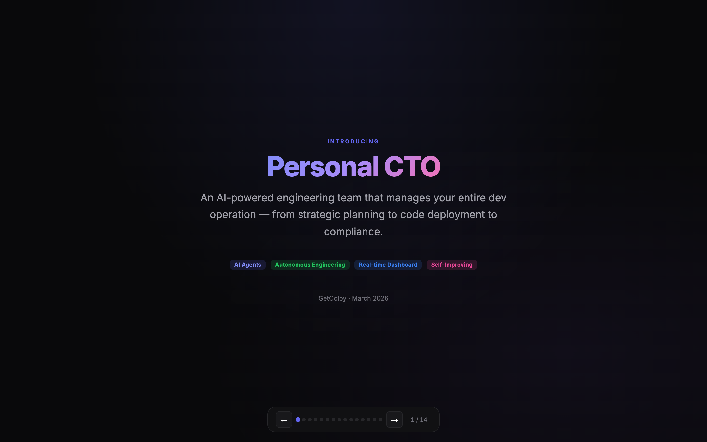
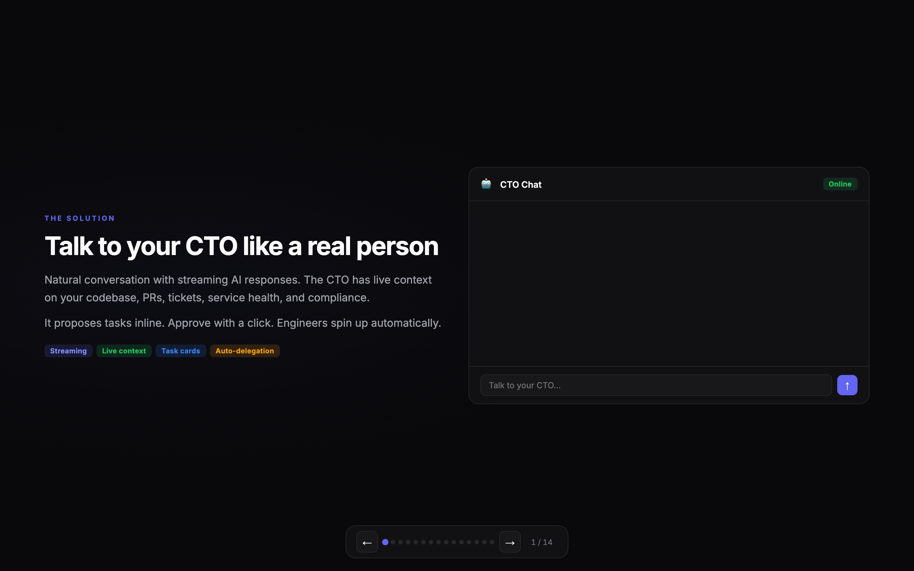
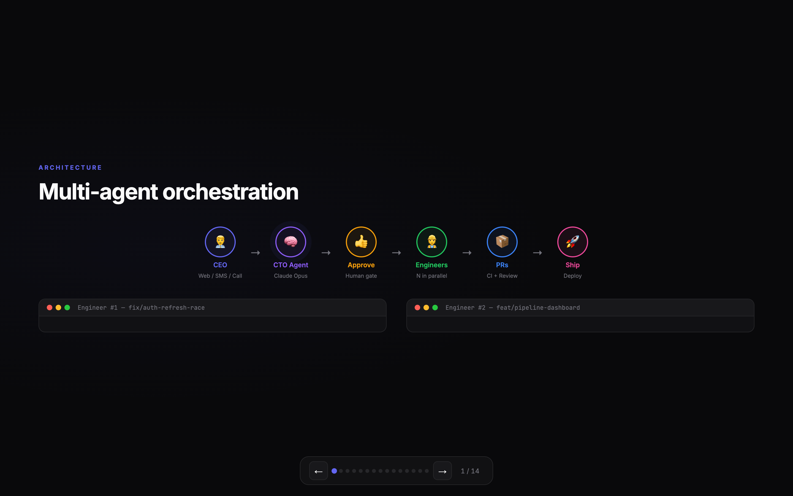
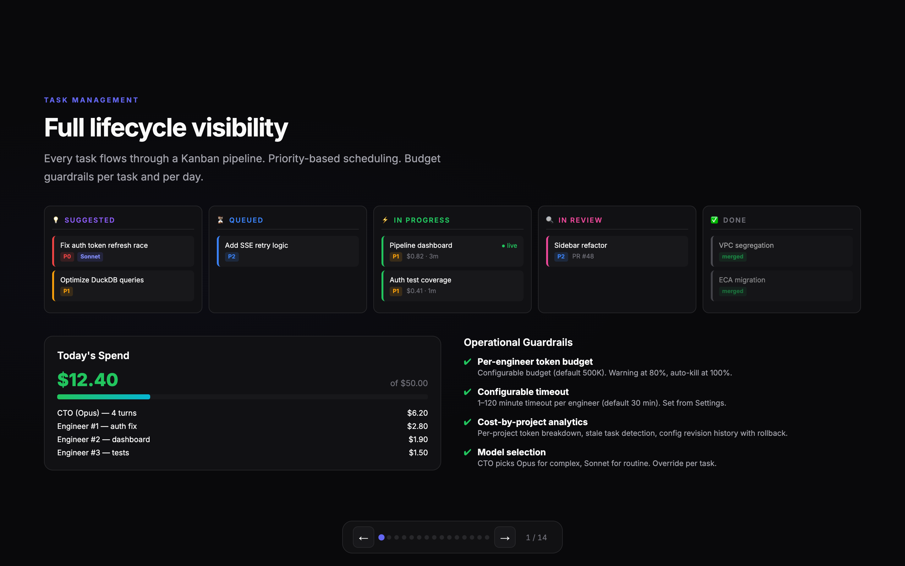
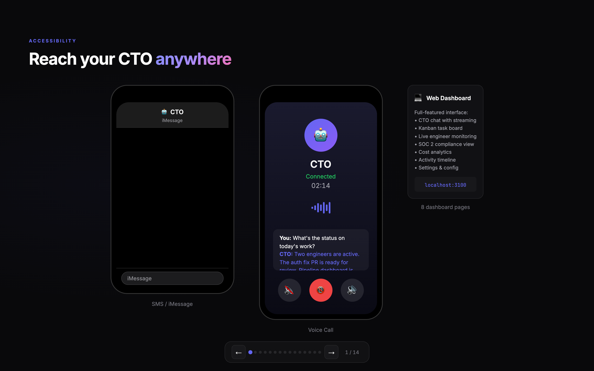
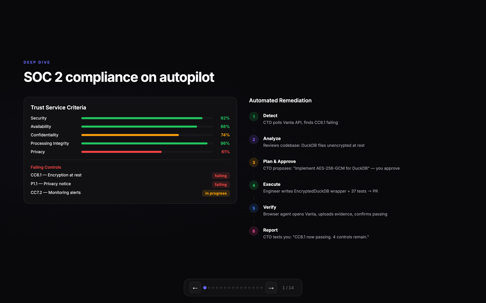
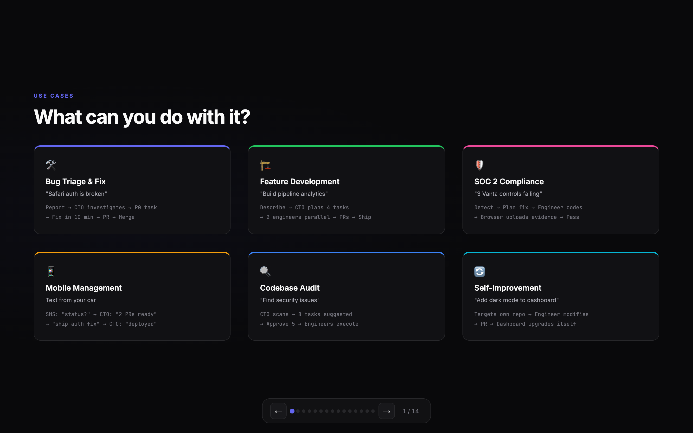
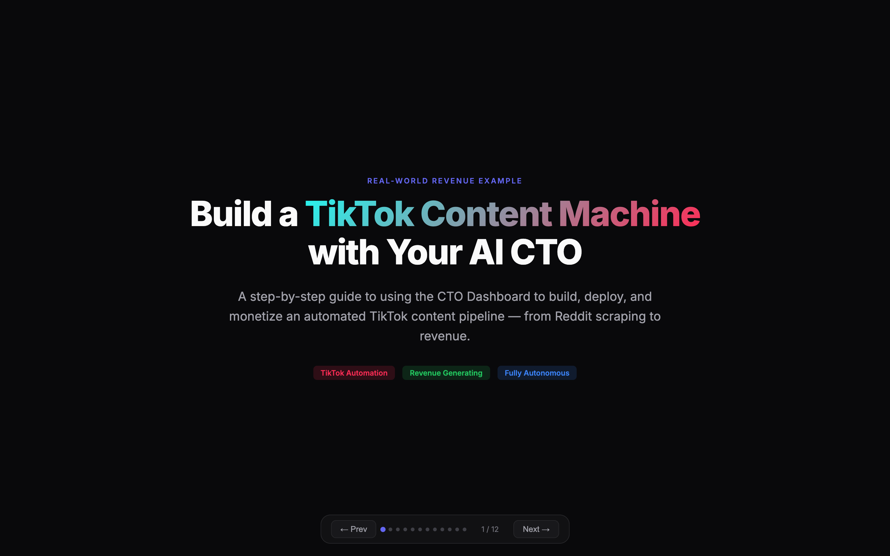

# Personal CTO

**An AI-powered engineering orchestrator that turns natural language into production-ready pull requests.**


<p align="center">
  
</p>

---

## The Problem

You're a solo founder. It's 11pm, and you realize the login page needs Google OAuth, the Notion board has three ungroomed tickets, and a CI check is failing on the dev branch. You could context-switch across six tools and three hours of focused work — or you could text your CTO.

## How It Actually Works

You open the dashboard (or Slack, or iMessage, or just call the phone number) and type:

> "Add Google OAuth to the login page, fix the failing CI on dev, and groom those three Notion tickets."

The CTO agent reads your Notion board, checks your GitHub PRs, queries GCP health, and responds with a plan. You approve. Three engineer agents spin up in parallel — one per task. Each clones the repo, creates a branch, writes code, runs tests, pushes, and opens a PR. A verification agent reviews each diff. Fifteen minutes later, you have three PRs in review, the Notion tickets are updated, and the CTO posts a summary to Slack.

No context switching. No boilerplate. No waiting until morning.

<p align="center">
  
</p>

---

## Architecture

<p align="center">
  
</p>

```
┌─────────────┐     WebSocket      ┌──────────────────┐     Claude CLI     ┌─────────────┐
│  Browser     │ ◄──────────────► │   Orchestrator   │ ◄───────────────► │  CTO Agent  │
│  Next.js 15  │     (JSON)       │   (Node.js)      │   (stream-json)   │  (Claude)   │
│  React 19    │                  │                  │                   └─────────────┘
└─────────────┘                  │   EventBus       │
                                  │   TaskQueue      │     Claude CLI     ┌─────────────┐
                                  │   EngineerPool   │ ──────────────►  │  Engineers   │
                                  │                  │   (×N parallel)    │  (Claude)   │
                                  └──────────────────┘                   └─────────────┘
                                          │                                     │
                                          ▼                                     ▼
                                  ┌──────────────────┐               ┌──────────────────┐
                                  │    Firestore      │               │  Git + GitHub     │
                                  │    (Database)     │               │  (PRs, Branches)  │
                                  └──────────────────┘               └──────────────────┘
```

**Three processes in development:**
| Service | Port | Purpose |
|---|---|---|
| Next.js | 3100 | React frontend with server-side rendering |
| WebSocket Orchestrator | 3101 | Message routing, CTO session, engineer pool |
| Twilio Webhooks | 3102 | Voice/SMS HTTP endpoints |

**Single process in production:** Next.js and WebSocket run on the same HTTP server (port 8080). WebSocket upgrades on `/ws`, everything else goes to Next.js. One container, one port, deployed to Cloud Run.

---

## Features

### Task Management & Kanban Pipeline

<p align="center">
  
</p>

- **7-Stage Pipeline** — `suggested → approved → queued → in_progress → verifying → in_review → done`
- **Kanban Board** — Visual task board with project filtering, auto-archive (7 days), collapsible columns, priority badges.
- **Priority-Ordered Dequeue** — P0 (critical) first, then P1, P2, P3. Critical work always gets picked up first.
- **Per-Engineer Token Budgets** — Warning at 80%, killed at 100%. Prevents runaway costs.
- **Retry with Error Context** — Failed tasks can be retried with the original error injected into the new engineer's prompt.
- **Follow-Up Instructions** — Send follow-up instructions to completed or failed tasks. A new engineer spawns on the same branch with full context.
- **Bulk Actions** — Approve all suggested tasks or kill all running engineers with a single action via Command Palette (Cmd+K).

### AI Orchestration
- **CTO Agent** — Claude with full context injection from Notion, GitHub, GCP, Vanta, and live task state. Gathers context in parallel via `Promise.allSettled` before every response.
- **Parallel Engineer Agents** — Multiple Claude instances execute simultaneously. Each clones a repo, creates a branch, writes code, runs tests, and opens a PR autonomously.
- **Natural Language Delegation** — Describe work in plain English. The CTO parses intent into structured task assignments with titles, descriptions, priorities, repo targets, and model recommendations.
- **Model Selection** — Choose Sonnet (fast), Opus (max capability), or Haiku (lightweight) per message or per engineer task.

### Multi-Channel Access

<p align="center">
  
</p>

- **Web Dashboard** — Full-featured React UI with real-time WebSocket updates.
- **Slack** — DMs, mentions, Block Kit approval buttons, strategy polls, offline message queue with recovery.
- **iMessage / SMS** — Text the CTO via Twilio. Voice-to-task pipeline.
- **Phone** — Call the CTO by phone number.

### Autonomous Operations

<p align="center">
  
</p>

- **Clarification Requests** — When the CTO encounters an ambiguous Notion ticket, it DMs the ticket creator on Slack, tracks the thread, and posts the reply back as a Notion comment. Fully autonomous.
- **Strategy Polls** — Posts architecture decision polls to Slack channels. Thread replies are matched to options, and the CTO receives aggregated results.
- **Self-Improvement** — The CTO assigns tasks targeting its own codebase. When it identifies needed improvements, it creates tasks for engineers to implement them.
- **Auto-Fix from Error Collection** — Collected errors automatically generate fix tasks with diagnostic context. 5-minute dedup fingerprinting prevents duplicates.

### Agentic Verification
- **AI Diff Review** — After an engineer finishes, the system reviews the git diff against task requirements. Catches off-target implementations before review.
- **Branch + PR Verification** — Checks that the engineer created and pushed the correct branch, and that the PR actually exists on GitHub.
- **Auto-Resolve** — Verification warnings trigger automatic re-spawning of an engineer to address concerns (up to 2 attempts).
- **GitHub PR Reviews** — Posts structured APPROVE / COMMENT / REQUEST_CHANGES reviews with inline line comments directly to GitHub.

### Use Cases

<p align="center">
  
</p>

### Deep Integrations
| Integration | Capabilities |
|---|---|
| **Notion** | Query board, auto-create tickets, sync status, post completion summaries, clarification routing |
| **GitHub** | PRs, CI status, diffs, code review, merge via squash, token-authenticated cloning |
| **Slack** | DMs, mentions, approval buttons, strategy polls, offline queue, periodic status updates |
| **GCP** | Cloud Run health checks, service logs, deployment monitoring |
| **Vanta** | SOC 2 compliance scoring, failing controls, one-click audit actions |
| **Twilio** | Call/text the CTO, voice-to-task pipeline |
| **Browser** | Puppeteer-based web UI automation for engineers and dogfood testing |

### Autonomous Project Execution
- **Multi-Phase Projects** — Create multi-phase projects with a single prompt. Each phase contains tasks with dependency ordering.
- **Autonomy Levels** — Supervised (all tasks need approval), semi-autonomous (P2/P3 auto-approve), autonomous (everything auto-approved). Time-bounded autonomy with automatic expiration.
- **Task Dependencies** — Tasks declare dependencies via `dependsOn`. Completion summaries flow downstream as context.
- **Auto-Merge & Deploy** — PRs that pass CI are auto-merged (squash + delete branch). Combined with auto-deploy, code goes from CTO chat to production without human intervention.
- **Failure Safeguards** — Configurable pause-on-failure count. After N consecutive task failures, the project pauses and notifies via Slack. P0 tasks always require human approval.

### Resilience Testing (Dogfood)
- **5 Test Suites** — Backend latency, visual regression, chat latency, proactive exploration, and full suite.
- **12 Chaos Monkey Scenarios** — Unicode, emoji floods, XSS injection, SQL injection, rapid-fire, viewport resize during streaming, and more.
- **Chrome Extension Harness** — Full Puppeteer-based testing with headless support. Loads extensions, auto-logins, captures screenshots and console errors.
- **Eval Import** — Paste evals in CSV, JSON, Markdown, YAML, or free-form text — the CTO parses them into structured eval definitions.

### CTO Memory & Skill Profiles
- **Persistent Memory** — Decisions, preferences, learnings, architecture choices persist across conversations in Firestore and are injected into every CTO prompt.
- **Skill Profiles** — Assign engineer specializations (frontend, backend, infra, custom). Each profile injects domain-specific system prompts, MCP servers, and env vars.
- **Tool Registry** — Configure external tools with API keys injected based on skill profile.

### Deploy Automation
- **Docker Build Pipeline** — Build images from repo Dockerfiles, tag with commit SHA, push to Container Registry.
- **Cloud Run Deployment** — One-click deploy with configurable per-repo targets. Automatic rollback on health check failure.
- **Health Check Verification** — Post-deploy health checks with automatic rollback.

---

## Real-World Example: TikTok Content Pipeline

<p align="center">
  
</p>

A step-by-step walkthrough of using the CTO Dashboard to build, deploy, and monetize an automated TikTok content pipeline — from Reddit scraping to revenue. See the full interactive demo in [`docs/ai-cto-real-world-example-tiktok.html`](docs/ai-cto-real-world-example-tiktok.html).

---

## Tech Stack

| Layer | Technology |
|---|---|
| Frontend | Next.js 15, React 19, TypeScript, Tailwind CSS 4, Zustand |
| Server | Node.js, WebSocket (ws), firebase-admin |
| Database | Google Firestore |
| AI | Claude CLI (`claude --print --output-format stream-json`) |
| Auth | NextAuth v5 (Google OAuth, configurable domain) |
| State | Zustand stores with WebSocket-driven updates |
| Deployment | Google Cloud Run, Docker (node:20-slim), GitHub Actions CI/CD |
| Testing | Puppeteer-based dogfood suite, 12 chaos monkey scenarios |

---

## Key Technical Decisions

### Why WebSocket over Polling
Every engineer streams output in real-time. With 10 concurrent engineers, polling would mean 10+ requests/second just for status. WebSocket gives us a single persistent connection with server-push semantics — the EventBus broadcasts events to all connected clients instantly.

### Why Claude CLI over API
Each engineer runs as an isolated subprocess via `claude --print --output-format stream-json`. This gives us:
- **Process isolation** — a stuck engineer can be `SIGTERM`'d without affecting others
- **Stream-json output** — structured JSON events for token tracking and progress parsing
- **Permission modes** — `--permission-mode bypassPermissions` for autonomous execution
- **Subscription billing** — OAuth token extraction routes usage through subscription instead of per-token API charges

### Why Firestore over SQLite
Started with SQLite for zero-config local dev. Migrated to Firestore when deploying to Cloud Run because:
- Cloud Run containers are ephemeral — SQLite files don't persist
- Firestore's `onSnapshot` gives us cross-instance config sync for free
- No connection pooling or migration tooling needed

### Why Zustand over Redux
The dashboard has 8 stores (chat, tasks, engineers, PRs, Slack, dogfood, toasts, setup). Zustand's minimal API means each store is ~30 lines. No providers, no action creators, no reducers. WebSocket messages dispatch directly to store methods.

### Autonomous Execution Safeguards
Running AI agents autonomously requires guardrails:
- **Token budgets** — per-engineer (default 500K tokens) and per-project. Warning at 80%, hard kill at 100%.
- **Consecutive failure counting** — projects auto-pause after N consecutive task failures.
- **P0 approval gates** — critical tasks always require human approval regardless of autonomy level.
- **AI verification** — every engineer's diff is reviewed by a verification agent before marking complete.
- **Auto-resolve loop** — verification warnings trigger up to 2 automatic re-attempts before escalating to human review.

### Multi-Repo Resolution
The CTO targets any configured repo via a `"repo"` field in task assignments. Resolution flows through:
1. Structured `repos[]` registry (name match or GitHub slug match)
2. Legacy path fallback (`colbyRepoPath`, `ctoDashboardRepoPath`)
3. Absolute path passthrough
4. Cloud Run: GitHub clone into temp directory with automatic cleanup

---

## Dashboard Pages

| Route | Description |
|---|---|
| `/chat` | CTO chat interface with streaming responses, thread management, model toggle |
| `/tasks` | Kanban board with auto-archive, project filtering, priority dequeue |
| `/tasks/[id]` | Task detail with engineer logs, follow-up instructions, status override |
| `/engineers` | Active engineer grid with live terminal output, progress milestones |
| `/pr-reviews` | Split-panel PR review: list + diff viewer, AI review, approve/merge |
| `/compliance` | SOC 2 compliance dashboard — scores, categories, failing controls, audit actions |
| `/analytics` | Token usage tracking, task stats, per-project cost breakdown |
| `/activity` | Chronological activity timeline with type icons and color coding |
| `/slack` | Slack conversation queue with filter tabs and CTO responses |
| `/dogfood` | 5 test suites, custom evals, chaos monkey, visual regression |
| `/features` | Interactive features guidebook — collapsible sections with diagrams and animations |
| `/docs` | Technical documentation — architecture, APIs, data models, WebSocket protocol |
| `/settings` | All config with secret masking, hot reload, revision history, rollback |
| `/login` | Google OAuth sign-in |

### Built-In Documentation

The dashboard includes two comprehensive reference pages, both built as interactive React components:

**`/features`** — A features guidebook with 13 collapsible sections covering AI orchestration, autonomous operations, task management, agentic verification, Slack intelligence, integrations, real-time monitoring, code review & compliance, resilience testing, production infrastructure, developer experience, operational guardrails, autonomous project execution, CTO memory, and deploy automation. Includes animated orchestration flow diagrams, task lifecycle pipeline visualization, and chaos monkey scenario grid.

**`/docs`** — Full technical documentation with sidebar navigation covering getting started, architecture (with ASCII system diagrams), all 15 page routes, component inventory, the complete WebSocket protocol (60+ message types), Firestore data models, server module breakdown, Zustand state management, integration details, prompt engineering, configuration layering, and deployment architecture.

---

## Getting Started

### Prerequisites
- Node.js 20+
- Claude CLI installed (`claude` on PATH)
- Google Cloud project with Firestore enabled
- Firebase service account key (`firebase-key.json`)

### Setup

```bash
# Clone
git clone https://github.com/EricBZhong/personal-cto.git
cd personal-cto

# Install
npm install

# Configure environment
cp .env.example .env.local
# Edit .env.local with your credentials:
#   GOOGLE_CLIENT_ID, GOOGLE_CLIENT_SECRET (NextAuth)
#   GOOGLE_APPLICATION_CREDENTIALS=./firebase-key.json
#   AUTH_ALLOWED_DOMAIN=yourdomain.com  (optional — omit to allow all Google accounts)

# Start development
npm run dev
# Next.js on http://localhost:3100
# Orchestrator on ws://localhost:3101
```

### Optional Integrations
All integrations are configured via the Settings page (`/settings`) — no code changes needed:
- **Notion** — API key + board ID
- **GitHub** — Personal access token
- **Slack** — Bot token + app token + signing secret
- **Vanta** — API key + OAuth credentials
- **Twilio** — Account SID + auth token + phone number
- **GCP** — Service health monitoring (requires `gcloud` CLI)

---

## Project Structure

```
src/
├── app/                    # Next.js 15 pages (15 routes)
│   ├── chat/               # CTO chat interface
│   ├── tasks/              # Kanban board + task detail
│   ├── engineers/          # Live engineer grid
│   ├── pr-reviews/         # PR review interface
│   ├── compliance/         # SOC 2 dashboard
│   ├── analytics/          # Token usage & metrics
│   ├── activity/           # Activity timeline
│   ├── slack/              # Slack conversation queue
│   ├── dogfood/            # Testing & evals
│   ├── features/           # Features guidebook
│   ├── docs/               # Technical documentation
│   ├── settings/           # Configuration
│   └── login/              # Google OAuth
├── components/             # React components
│   ├── layout/             # DashboardShell, Sidebar, CommandPalette
│   ├── chat/               # CTOChat, MessageBubble, ChatInput
│   ├── tasks/              # TaskBoard, TaskCard, TaskDetailSidebar
│   ├── engineers/          # EngineerCard, EngineerGrid
│   └── shared/             # StatusBadge, SetupWizard, Toast
├── hooks/                  # useWebSocket, useCTOChat, useTasks, useErrorReporter
├── stores/                 # Zustand stores (chat, tasks, engineers, PRs, Slack, dogfood)
├── server/                 # Orchestrator (Node.js)
│   ├── orchestrator.ts     # Central message router (60+ WS message types)
│   ├── cto-session.ts      # CTO Claude conversation lifecycle
│   ├── engineer-pool.ts    # Parallel engineer spawning & verification
│   ├── task-queue.ts       # Task CRUD (Firestore + local cache)
│   ├── config.ts           # Layered config (defaults → env → Firestore)
│   ├── production.ts       # Single-port server for Cloud Run
│   ├── prompts/            # CTO & engineer prompt builders
│   ├── integrations/       # Notion, GitHub, GCP, Vanta, Slack, Twilio, Browser
│   └── dogfood/            # Extension harness, test runner
├── auth.ts                 # NextAuth v5 config
└── types.ts                # Shared TypeScript interfaces
```

---

## WebSocket Protocol

The frontend and server communicate exclusively over WebSocket using JSON messages: `{ type, payload }`.

**60+ message types** across categories: chat, threads, tasks, engineers, config, integrations (Notion, GitHub, GCP), compliance, analytics, dogfood/evals, Slack, PR reviews, daily check-ins, projects, memory, and deploys.

See the full protocol reference at `/docs` in the running dashboard or in `specs/websocket-protocol.md`.

---

## Additional Documentation

- **[Interactive Demo Deck](docs/personal-cto-deck.html)** — 15-slide product demo with animated chat simulations, architecture diagrams, and feature deep-dives
- **[Real-World Example: TikTok Pipeline](docs/ai-cto-real-world-example-tiktok.html)** — 32-slide walkthrough building a revenue-generating TikTok content pipeline
- **[`/features`](src/app/features/page.tsx)** — Interactive features guidebook (rendered in the dashboard)
- **[`/docs`](src/app/docs/page.tsx)** — Technical documentation (rendered in the dashboard)
- **[`specs/`](specs/)** — Comprehensive spec directory covering architecture, pages, components, server, WebSocket protocol, data models, integrations, state management, configuration, prompts, and deployment
